# Фреймворк Django (семинары)
# Урок 2. Работа с моделями
## Описание
На этом семинаре мы:
- разберёмся в создании моделей;
- изучим миграции;
- узнаем о создании собственных команд;
- поработаем с моделями данных, CRUD.
  <br><hr>
## Домашнее задание
Уважаемые студенты! Обращаем ваше внимание, что сдавать домашнее задание необходимо через Git.

Задание: <br>
Создайте три модели Django: клиент, товар и заказ.

Клиент может иметь несколько заказов. Заказ может содержать несколько товаров. Товар может входить в несколько заказов.

Поля модели «Клиент»:
- имя клиента
- электронная почта клиента
- номер телефона клиента
- адрес клиента
- дата регистрации клиента

Поля модели «Товар»:
- название товара
- описание товара
- цена товара
- количество товара
- дата добавления товара

Поля модели «Заказ»:
- связь с моделью «Клиент», указывает на клиента, сделавшего заказ
- связь с моделью «Товар», указывает на товары, входящие в заказ
- общая сумма заказа
- дата оформления заказа

Допишите несколько функций CRUD для работы с моделями по желанию. Что по вашему мнению актуально в такой базе данных.
<br><hr>
## Решение задания

Необходимо, что Python и pip уже установлены в систему глобально. <br>
Это позволяет разработать Django-проект с возможностью создания, удаления и обновления данных о клиентах, продуктах и заказах. <br>
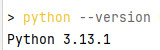

Проект имеет полный цикл управления данными (CRUD) для всех трёх сущностей приложения: клиент, продукты, заказы. <br>
Проект сохраняет журналы активности с помощью логирования в файл `debug.log`.
<br><br>
### 1. Создание проекта Django в папке `shop_project`

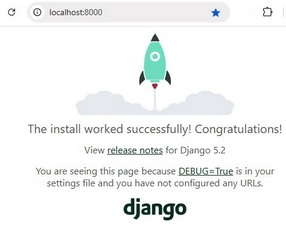

1. Открыть командную строку (`cmd`) или PowerShell с правами администратора.

2. Перейти на диск `E:` и создать новую директорию для проекта:
   ```bash
   cd e:\
   mkdir lesson_2
   cd lesson_2
   ```

3. Установить виртуальное окружение для изоляции зависимостей проекта:
   ```bash
   python -m venv myvenv
   myvenv\Scripts\activate.bat
   ```
   
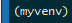


4. Установить Django:
   ```bash
   pip install django
   ```

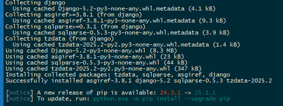

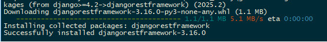
   
5. Создаем проект Django:
   ```bash
   django-admin startproject shop_project .
   ```  
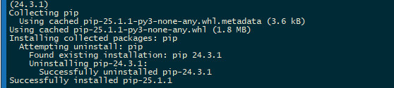

<br><br>
### 2. Создание моделей Django - клиенты, товары и заказы

1. После, как установлено виртуальное окружение, есть перед командной строкой обозначение `myvenv`, <br> 
   и запущен фреймворк, создать в той же деректории проекта Django - приложение, <br>  
   которое будет отвечать за хранение клиентов, товаров и заказов. <br>
   Команда в терминале внутри проекта создать новое приложение `shop`:
   ```bash
   python manage.py startapp shop
   ```
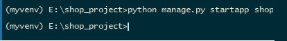  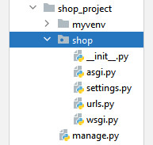

2. Добавить вновь созданное приложение в список установленных приложений в файле `settings.py`, <br> 
   для этого найти переменную `INSTALLED_APPS`, добавить туда приложение:
   ```
   INSTALLED_APPS = [
       # ...
       'shop',
   ]
   ```
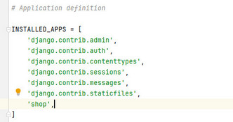

3. Модели определяются в файле `shop/models.py`. 
   Перейти в каталог приложения `shop/models.py` и указать модели для проекта:

```
from django.db import models
from django.contrib.auth.models import User

class Profile(models.Model):
    user = models.OneToOneField(User, on_delete=models.CASCADE)
    phone_number = models.CharField(max_length=15)
    address_city = models.CharField(max_length=100)
    registration_date = models.DateTimeField(auto_now_add=True)

    def __str__(self):
        return self.user.username

class Product(models.Model):
    name = models.CharField(max_length=100)
    description = models.TextField()
    price = models.DecimalField(max_digits=8, decimal_places=2)
    quantity = models.PositiveIntegerField(default=0)
    added_date = models.DateTimeField(auto_now_add=True)

    def __str__(self):
        return self.name

class Order(models.Model):
    client = models.ForeignKey(User, on_delete=models.CASCADE)
    products = models.ManyToManyField(Product, through='OrderItem')
    total_amount = models.DecimalField(max_digits=10, decimal_places=2)
    order_date = models.DateTimeField(auto_now_add=True)

    def __str__(self):
        return f'Order #{self.id}'

class OrderItem(models.Model):
    product = models.ForeignKey(Product, on_delete=models.CASCADE)
    order = models.ForeignKey(Order, on_delete=models.CASCADE)
    quantity = models.PositiveIntegerField(default=1)

    def __str__(self):
        return f'{self.product} in {self.order}'
```


<br><br>
### 3. Подключение базы данных и заполнение начальными данными

1. По умолчанию Django использует SQLite. <br>
   В корневой папке проекта создать папку 'databases' и настроить настройки подключения к базе данных. <br>
   Для этого в файле `settings.py` заменить блок настроек баз данных следующим образом:
```
DATABASES = {
    'default': {
        'ENGINE': 'django.db.backends.sqlite3',
        'NAME': BASE_DIR / 'databases/db.sqlite3',
    }
}
```

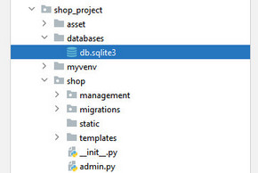

2. Выполнить миграции, чтобы применить изменения структуры таблиц:
   ```bash
   python manage.py makemigrations
   python manage.py migrate
   ```
   
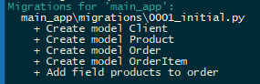  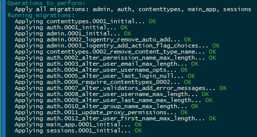

3. Для заполнения базы данных случайными тестовыми данными, для удобства тестирования 
   можно использовать модулем Faker, для этого установить библиотеку:
   ```bash
   pip install faker
   ```

4. Создать скрипт для генерации фиктивных данных в папке `shop/management/commands/populate_db.py` в файле `populate_db.py` в корне каталога проекта:
```
from django.core.management.base import BaseCommand
from faker import Faker
from shop.models import *

fake = Faker('ru_RU')

class Command(BaseCommand):
    help = 'Populates the database with fake data'

    def handle(self, *args, **options):
        users = []
        profiles = []
        products = []
        
        # Генерируем фейковых пользователей
        for i in range(50):
            username = fake.user_name()
            password = fake.password(length=10)
            new_user = User(username=username, email=fake.email())
            new_user.set_password(password)
            new_user.save()
            
            profile = Profile(user=new_user, phone_number=fake.phone_number(), address_city=fake.city())
            profile.save()
            users.append(new_user)
            profiles.append(profile)
        
        # Генерируем продукцию
        categories = ['Фрукты', 'Овощи', 'Напитки']
        for _ in range(70):
            product = Product(name=f"{categories[random.randrange(len(categories))]} : {fake.word()}",
                              description=fake.text(),
                              price=round(random.uniform(10, 100), 2),
                              quantity=random.randint(1, 100))
            product.save()
            products.append(product)
        
        # Создаем случайные заказы
        for user in users[:20]:
            order = Order(client=user,
                          total_amount=sum([p.price for p in random.sample(products, k=random.randint(1, len(products)))])
                         )
            order.save()
            selected_products = random.sample(products, k=random.randint(1, len(products)))
            for prod in selected_products:
                item = OrderItem(order=order, product=prod, quantity=random.randint(1, 10))
                item.save()
```

5. Теперь запустить указанный скрипт генерации данных командой:
   ```bash
   python manage.py populate_db
   ```

<br><br>
### 4. Реализация функций CRUD (Create-Read-Update-Delete):
Требуется реализовать базовые операции — создание, чтение, обновление и удаление данных.
##### 1. Операции CRUD для клиентов:
Модель: Client
- Create: Создание нового клиента.
- Read: Просмотр списка существующих клиентов.
- Update: Изменение данных существующего клиента.
- Delete: Удаление клиента.

1. Форму для клиента указываем в файл 'shop/forms.py':
   
```
from django import forms
from .models import Profile

class ClientProfileForm(forms.ModelForm):
    class Meta:
        model = Profile
        exclude = ('user',)  # Исключить поле user, так как устанавливается автоматически
```   


Затем в `views.py` добавить контроллер - обработчик формы для клиента:
   ```
# shop/views.py
from django.shortcuts import render, redirect
from django.http import HttpResponseRedirect
from django.urls import reverse
from django.views.generic.edit import FormView
from django.contrib.auth.decorators import login_required
from .models import Profile
from .forms import ClientProfileForm

@login_required
def update_profile(request):
    """Обновление профиля текущего пользователя"""
    try:
        profile = request.user.profile
    except Profile.DoesNotExist:
        profile = None
    
    if request.method == 'POST':
        form = ClientProfileForm(request.POST, instance=profile)
        if form.is_valid():
            profile = form.save(commit=False)
            profile.user = request.user
            profile.save()
            return redirect(reverse('home'))  # Возврат на главную страницу
    else:
        form = ClientProfileForm(instance=profile)
    
    return render(request, 'update_profile.html', {'form': form})
   ```

2. Шаблон 'templates/update_profile.html' для редактирования профиля создать в каталоге 'templates' приложения 'shop':
```
   <!-- templates/update_profile.html -->
<h1>Редактировать Профиль</h1>
<form action="" method="post">
    
    {{ form.as_p }}
    <input type="submit" value="Сохранить"/>
</form>
<p><a href="">Вернуться назад</a></p>
   ```


Аналогично реализуются операции CRUD для продукта и заказа, где `Создание продукта` аналогично клиенту, используя соответствующую форму,
`Удаление продукта` - аналогичный метод удаления записи, для операции `Редактирование продукта` применяется такая же логика обновления поля.


<br><br>
### 2. Реализации операций CRUD для продуктов
Модель: Product.
Операции CRUD включают создание, просмотр, редактирование и удаление продукта.

1. Форма для продукта 'shop/forms.py':

```
from django import forms
from .models import Product

class ProductForm(forms.ModelForm):
    class Meta:
        model = Product
        fields = '__all__'  # Применяются все поля модели
```

2. Контроллеры для продукта, требуется реализовать обработку формы. <br>
   Код аналогичен примеру с добавлением клиента, но применён к модели `Product`, открыть файл `shop/views.py` и дописать код:

```
# shop/views.py
from django.views.generic.edit import CreateView, UpdateView, DeleteView
from django.urls import reverse_lazy
from .models import Product
from .forms import ProductForm

class AddProduct(CreateView):
    """Представление для добавления нового продукта."""
    model = Product
    template_name = 'add_product.html'
    success_url = '/'  # После успешного сохранения возврат на главную
    form_class = ProductForm

class EditProduct(UpdateView):
    """Представление для редактирования продукта."""
    model = Product
    template_name = 'edit_product.html'
    success_url = '/'  # После успешной модификации возврат обратно
    form_class = ProductForm

class DeleteProduct(DeleteView):
    """Представление для удаления продукта."""
    model = Product
    success_url = '/'  # После удаления возврат на главную
```

3. Создать шаблон `templates/add_product.html` для отображения формы добавления продукта:

```
<!-- templates/add_product.html -->
<h1>Добавить Новый Продукт</h1>
<form action="" method="post">
    
    {{ form.as_p }}
    <input type="submit" value="Добавить"/>
</form>
<p><a href="">Вернуться назад</a></p>
```

4. Удаление продукта - простая реализация удаления продукта по идентификатору в файле `templates/edit_product.htm`:

```
<!-- templates/edit_product.html -->
<h1>Редактировать Продукт</h1>
<form action="" method="post">
    
    {{ form.as_p }}
    <input type="submit" value="Сохранить"/>
</form>
<p><a href="">Вернуться назад</a></p>
```

<br><br>
### 3. Операции CRUD для Модели "Заказ"
Модель: Order.
Операции CRUD включают создание, просмотр, редактирование и удаление заказа.

1. Форма для заказа в файле `shop/forms.py`:
```
from django import forms
from .models import Order

class OrderForm(forms.ModelForm):
    class Meta:
        model = Order
        fields = '__all__'  # Используем все поля
```
2. Создать контроллеры для создания нового заказа в файле `shop/views.py`:

```
from django.views.generic.edit import CreateView, UpdateView, DeleteView
from django.urls import reverse_lazy
from .models import Order
from .forms import OrderForm

class AddOrder(CreateView):
    """Представление для добавления нового заказа."""
    model = Order
    template_name = 'add_order.html'
    success_url = '/'  # После добавления возврат на главную 
    form_class = OrderForm

class EditOrder(UpdateView):
    """Представление для редактирования заказа."""
    model = Order
    template_name = 'edit_order.html'
    success_url = '/'  # После редактирования возврат на главную 
    form_class = OrderForm

class DeleteOrder(DeleteView):
    """Представление для удаления заказа."""
    model = Order
    success_url = '/'  # После удаления возврат на главную 
```

3. Шаблон `templates/add_order.html`:

```
<!-- templates/add_order.html -->
<h1>Добавить Новый Заказ</h1>
<form action="" method="post">
    
    {{ form.as_p }}
    <input type="submit" value="Добавить"/>
</form>
<p><a href="">Вернуться назад</a></p>
```

4. Шаблон для редактирования заказа - метод обработки формы для редактирования заказа в файле `templates/edit_order.html`:

```
<!-- templates/edit_order.html -->
<h1>Редактировать Заказ</h1>
<form action="" method="post">
    
    {{ form.as_p }}
    <input type="submit" value="Сохранить"/>
</form>
<p><a href="">Вернуться назад</a></p>
```


<br><br>
### 4. Логирование запросов в файл `debug.log`

1. Открыть файл `settings.py` и добавить конфигурацию для логирования. Это позволит записывать запросы и исключения в файл `debug.log`.:
```
LOGGING = {
    'version': 1,
    'disable_existing_loggers': False,
    'handlers': {
        'file': {
            'level': 'DEBUG',
            'class': 'logging.FileHandler',
            'filename': 'debug.log',
        },
    },
    'loggers': {
        'django.request': {
            'handlers': ['file'],
            'level': 'DEBUG',
            'propagate': True,
        },
    },
}
```

<br><br>
### 5. Конфигурация маршрутов, маршрутизация в проекте

1. Если методы предполагают наличие работы с формами и шаблонами, необходимо настроить маршруты. <br>
Следует проверить конфигурацию маршрутов `urls.py` приложения и зарегистрировать все CRUD-контроллеры в файле маршрутов приложения `shop/urls.py`:

```
from django.urls import path
from .views import (
    AddProduct, EditProduct, DeleteProduct,
    AddOrder, EditOrder, DeleteOrder,
    update_profile
)

urlpatterns = [
    path('add-product/', AddProduct.as_view(), name='add_product'),
    path('edit-product/<int:pk>/', EditProduct.as_view(), name='edit_product'),
    path('delete-product/<int:pk>/', DeleteProduct.as_view(), name='delete_product'),

    path('add-order/', AddOrder.as_view(), name='add_order'),
    path('edit-order/<int:pk>/', EditOrder.as_view(), name='edit_order'),
    path('delete-order/<int:pk>/', DeleteOrder.as_view(), name='delete_order'),

    path('update-profile/', update_profile, name='update_profile'),
]
```

2. Подключить это приложение в главном файле маршрутов проекта `shop_project/urls.py`:

```
# shop_project/urls.py
from django.contrib import admin
from django.urls import include, path

urlpatterns = [
    path('admin/', admin.site.urls),
    path('', include('shop.urls')),  # Маршруты приложения 'shop'
]
```

<br><br>
### 6. Запуску проекта Django на локальном сервере

Требования перед началом:
- Python установлен в операционную систему (рекомендуемая версия python >= 3.8);
- Командная строка находится в корневой директории проекта Django;
- Активировано виртуальное окружение (`myvenv`);
- **Если работа с проектом уже проводится, и включено виртуальное окружение, <br>то сразу выполнить [пункт 6](#запустить-локальный-веб).**


Действия для запуска проекта (начало):
1. Активировать виртуальное окружение, перейдя в папку проекта и активировав виртуальное окружение:

   ```bash
   cd E:\shop_project
   myvenv\Scripts\activate.bat
   ```

2. Проверить зависимости, что все необходимые пакеты (например, Django, Psycopg2 и другие) установлены:

   ```bash
   pip freeze
   ```

   Если некоторые пакеты отсутствуют, переустановите их заново:

   ```bash
   pip install -r requirements.txt
   ```

3. Запустить миграцию базы данных, чтобы убедиться, что база данных синхронизирована с последней версией:

   ```bash
   python manage.py makemigrations
   python manage.py migrate
   ```


4. Если требуется, создать суперпользователя (опционально).
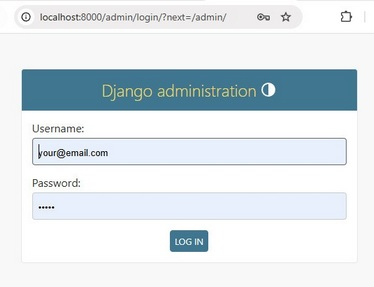 <br>

- Если нужен доступ к административной панели Django: 
   - Выполнить команду:

   ```bash
   python manage.py createsuperuser
   ```
   - Следовать инструкциям для ввода имени пользователя, электронной почты и пароля. <br><br>

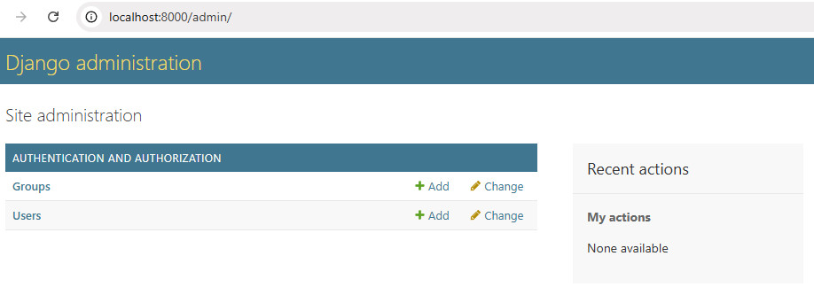
   
5. Если настроены права суперпользователя, то доступ к административным интерфейсам (административная панель)<br> возможен по адресу: [http://127.0.0.1:8000/admin/](http://127.0.0.1:8000/admin/). <br>
   Для доступа к панели администратора следует использовать учетные данные суперпользователя, созданные ранее. <br><br>
   http://localhost:8000/admin/auth/user/

>
>6. <p id="запустить-локальный-веб">Запуск проекта Django на локальном веб-сервере</p> 
>
>- Проверить наличие миграций после каждого изменения данных и <br>
   >  выполнить миграции данных в проект, применив команду миграции:
>```
>python manage.py makemigrations shop 
>```
>- Создать или обновить схемы таблиц в базе данных:
>```
>python manage.py migrate 
>```
>
>- После внесения изменений перезапустите сервер, выполнив команду:
   >  ``` python manage.py runserver ```
>
> 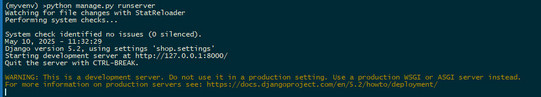
>
>- Так как, по умолчанию Django стартует на порту `8000`, следует открыть браузер<br> и перейти по адресу: [http://127.0.0.1:8000/](http://127.0.0.1:8000/).  <br><br>
>
> 
> 

 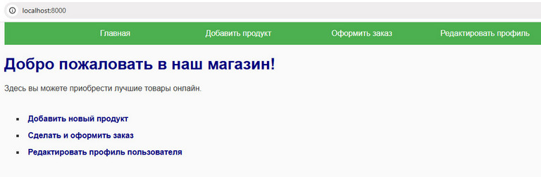

<br><br>
### 7. Маршрутизация в браузере 

- Главная страница проекта http://127.0.0.1:8000/
- Список всех клиентов http://127.0.0.1:8000/clients/
- Список всех продуктов http://127.0.0.1:8000/products/
- Список всех заказов http://127.0.0.1:8000/orders/
- Информация о конкретном клиенте http://127.0.0.1:8000/clients/1/ #http://127.0.0.1:8000/clients/{ID_клиента}/
- Информация о конкретном товаре http://127.0.0.1:8000/products/1/ #http://127.0.0.1:8000/products/{ID_товара}/
- Информация о конкретном заказе http://127.0.0.1:8000/orders/1/ #http://127.0.0.1:8000/orders/{ID_заказа}/
- Страница редактирования конкретного заказа http://127.0.0.1:8000/edit-order/1/ #http://127.0.0.1:8000/edit-order/{ID_заказа}/
- Страница добавления нового клиента http://127.0.0.1:8000/add-client/
- Страница добавления нового товара http://localhost:8000/add-product/
- Страница добавления нового заказа http://localhost:8000/add-order/
- Страница редактирования профиля http://localhost:8000/update-profile/

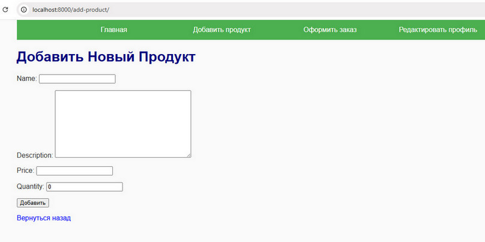

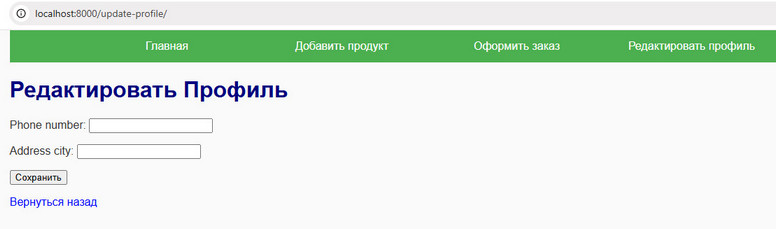

<br><br>
### 8. Остановка сервера

После окончания работы с сервером Django требуется остановка сервера или деактивация, выход из локального окружения. <br>
- Всегда останавливать сервер перед переходом к другим действиям.
- Использовать команду `deactivate` только после того, как вышли из запущенного сервера Django.
- Новый проект можно создавать сразу после освобождения консоли путём остановки текущего сервера.
- Если сервер не остановить, консоль останется заблокированной процессом Django, и никакие новые команды не смогут быть выполнены.
- Деактивация виртуального окружения возможна только тогда, когда оно было предварительно активировано.

Сервер Django остановится автоматически, если отправить сигнал прерывания процесса. Для этого можно воспользоваться комбинацией клавиш: <br>
- В Windows или Linux: **Ctrl+C**
- В macOS: **Command + C**

После нажатия комбинации клавиш сервер завершит свою работу, и можно вводить команды в консоли.
Ввести команду деактивации, которая вернет обратно в глобальную среду системы разработки:
```bash
myvenv\Scripts\deactivate.bat
```


<br><hr><hr>
## Дополнительная информация

<br><br>
### Создание моделей

Модели представляют собой таблицы базы данных и определяют структуру данных, используемых приложением.

1. Открыть файл `models.py` приложения (например, `./mysite/blog/models.py`).

2. Определить первую модель, наследуя класс `Model` из модуля `django.db.models`:

```
from django.db import models

class Post(models.Model):
    title = models.CharField(max_length=200)
    content = models.TextField()
    created_at = models.DateTimeField(auto_now_add=True)
    
    def __str__(self):
        return self.title
```

Здесь определяем простую модель `Post`, состоящую из полей:
- `title`: заголовок поста (строка длиной максимум 200 символов),
- `content`: содержание поста (текстовое поле),
- `created_at`: дата создания поста (получаемая автоматически при создании записи).
- метод `__str__()` возвращает читабельное представление экземпляра модели.

<br><br>
### Миграции

Миграция - это способ изменения структуры базы данных (создание таблиц, изменение существующих столбцов и т.п.) через управление изменениями схемы базы данных. <br>
Эти две команды необходимы каждый раз, когда внесены изменения в модели (добавлены новые поля, изменены типы данных и прочее).
1. Чтобы применить изменения, созданные в файлах моделей, необходимо запустить миграции. Эта команда создает файлы миграций для каждой модели:

```bash
python manage.py makemigrations
```
2. Затем применить созданные миграции к базе данных:

```bash
python manage.py migrate
```
Миграции - это важнейший компонент Django, обеспечивающий гибкость и безопасность при изменении структуры данных. <br>
В Django служат для отслеживания и синхронизации изменений структуры данных (моделей) с базой данных. <br>
Без выполнения миграции, возникает несоответствие между структурой базы данных и тем, что написано в моделях. <br>
Когда изменяем существующие модели или добавляем новые, база данных должна соответствовать новым требованиям. <br>

##### Требования для миграции

1. Обновление структуры базы данных, когда каждая модель соответствует таблице в базе данных. Если добавили или удалили поле, либо изменили его тип, база данных должна отражать эти изменения. Именно миграции выполняют такие обновления, обеспечивая согласованность между моделями и базой данных. <br>

2. Автоматизация изменений, где вместо того чтобы вручную писать SQL-запросы для внесения изменений в базу данных, Django делает это автоматически через механизм миграций. Достаточно лишь вызывать команду `makemigrations`, а Django генерирует соответствующий SQL-код. <br>

3. Безопасность и обратимость, когда любое изменение в структуре базы данных фиксируется в виде файла миграции, что позволяет легко вернуться назад (откатить изменения), если возникла ошибка или необходимость отката изменений. <br>

4. Совместимость с различными СУБД, потому что, несмотря на то, что различные базы данных имеют различный синтаксис SQL-команд, Django абстрагируется от деталей конкретной БД и обеспечивает одинаковый API независимо от выбранной СУБД (MySQL, PostgreSQL, SQLite и др.). Миграционные механизмы работают одинаково хорошо вне зависимости от типа базы данных. <br>

5. Управление историей изменений, где каждый файл миграции имеет уникальный идентификатор, что позволяет отслеживать историю изменений и облегчает понимание того, какие изменения были внесены ранее.


##### Процесс выполнения миграции состоит из двух этапов:

1. Генерация миграционного файла - команда `python manage.py makemigrations` создаёт новый файл миграции, содержащий инструкции для внесения изменений в базу данных. <br>

2. Применение миграций - команда `python manage.py migrate` отправляет инструкции из миграционного файла в базу данных, обновляя её структуру. <br>


В Django можно отменять миграции, называемые также "rollback".
- Отмена миграции применяется, когда необходимо вернуть базу данных к предыдущему состоянию, восстановить прежнюю структуру данных или устранить последствия неудачной миграции.
- Перед выполнением отмены требуется проверить, что важные данные сохранены, так как эта операция может привести к потере данных.
- Отмена миграции не уничтожает сам миграционный файл. Если нужно удалить ненужные миграционные файлы, их нужно удалять вручную, убедившись предварительно, что соответствующие изменения уже применены или нет необходимости возвращаться к ним.

##### Отменить миграцию можно двумя способами:

1. Откат одной последней миграции. Этот метод удобен, если необходимо отменить самую последнюю миграцию:

```bash
python manage.py migrate appname previous
```
Например, если приложение называется `blog`, команда будет такой:

```bash
python manage.py migrate blog previous
```
, где команда "previous" обозначает предыдущий этап относительно текущего состояния миграции.


2. Возвращение к определенной точке (конкретной миграции). Если требуется перейти к предыдущей конкретной миграции, сначала проверьте список доступных миграций с помощью команды:

```bash
python manage.py showmigrations
```

Например, есть следующая история миграций:

```
[X] 0001_initial
[X] 0002_change_field
[X] 0003_add_new_model
```

И нужно вернуться к первой миграции ("initial"). Эта команда приведет базу данных к состоянию, соответствующему первому миграционному файлу:

```bash
python manage.py migrate blog 0001
```

<br><br>
### Создание собственных команд

Иногда полезно расширить функциональность управления проектом Django с помощью собственной команды. <br>
Собственные команды упрощают рутинные операции или создают уникальные возможности автоматизации. <br>
Это делается путём добавления новых команд в модуль `management/commands`.

1. Создать в приложении директорию `management` и вложенную директорию `commands`, если они отсутствуют:

```
./mysite/blog/
./mysite/blog/management/
./mysite/blog/management/commands/
./mysite/blog/management/commands/hello.py
```

2. В новом файле `hello.py` написать собственную команду:

```
from django.core.management.base import BaseCommand

class Command(BaseCommand):
    help = 'Prints a greeting message'

    def handle(self, *args, **options):
        print("Hello from custom command!")
```

3. Запустить свою команду через интерфейс управления Django:

```bash
python manage.py hello
```

Должен получиться вывод:

```
Hello from custom command!
```

<br><br>
### Работа с моделями данных, CRUD

CRUD (Create, Read, Update, Delete) - это базовые операции над объектами баз данных.

##### 1. Create (создание объектов)

Пример создания объекта класса `Post`:

```
post = Post(title="First post", content="This is the first post.")
post.save()  # Сохраняет объект в базу данных
```

##### 2. Read (чтение объектов)

Получение всех постов:

```
posts = Post.objects.all()
for p in posts:
    print(p.title)
```

Фильтрация записей:

```
first_post = Post.objects.filter(title='First post').first()
print(first_post.content)
```

##### 3. Update (обновление объектов)

Изменить существующий объект:

```
first_post = Post.objects.get(pk=1)
first_post.title = "Updated Title"
first_post.save()
```

##### 4. Delete (удаление объектов)

Удалить запись:

```
post_to_delete = Post.objects.get(pk=1)
post_to_delete.delete()
```

<br><br>
### Типы полей доступны в моделях Django

В Django доступно большое количество типов полей, предназначенных для разных видов данных. <br>
Эти типы полей покрывают большинство потребностей при разработке веб-приложений с использованием Django. <br>
Они обеспечивают удобную реализацию специфики различных типов данных и их валидаторов. <br>
Правильный выбор типа поля гарантирует корректную работу приложения, оптимизирует производительность и повышает удобство сопровождения проекта. <br>
**Список самых распространённых типов полей, используемых в моделях Django**:

1. Text Fields (Строковые поля):
   - CharField - используется для коротких строковых значений (до 255 символов). Обычно используется для небольших фрагментов текста, таких как имена, адреса электронной почты и т.д.
     ```
     title = models.CharField(max_length=100)
     ```

   - TextField: Предназначен для длинных текстовых блоков (описания статей, сообщений, комментариев и т.д.).
     ```
     content = models.TextField()
     ```

   - EmailField - специальный тип поля для ввода электронных почтовых адресов с проверкой формата email.
     ```
     email = models.EmailField()
     ```

   - SlugField - строковое поле, предназначенное для удобочитаемых URL-имен. Часто используется для формирования SEO-дружественных ссылок.
     ```
     slug = models.SlugField(unique=True)
     ```

   - URLField - хранит URL-адреса с дополнительной проверкой корректности форматов URL.
     ```
     website = models.URLField()
     ```

2. Numeric Fields (Числовые поля):
   - IntegerField - целочисленное значение.
     ```
     quantity = models.IntegerField(default=0)
     ```

   - FloatField - число с плавающей точкой.
     ```
     price = models.FloatField()
     ```

   - DecimalField - высокоточное числовое поле с фиксированной точностью (используется чаще всего для денежных сумм).
     ```
     amount = models.DecimalField(max_digits=10, decimal_places=2)
     ```

   - PositiveIntegerField - положительное целое число.
     ```
     age = models.PositiveIntegerField()
     ```

3. Date & Time Fields (Дата и время):
   - DateField - дата без учета времени.
     ```
     birthday = models.DateField()
     ```

   - DateTimeField - полное датированное время (дата + время).
     ```
     published_date = models.DateTimeField(auto_now_add=True)
     ```

   - TimeField - только время суток.
     ```
     time_opened = models.TimeField()
     ```

   - DurationField - интервал времени (разница между двумя временными отметками).
     ```
     duration = models.DurationField()
     ```

4. Boolean Fields (Логические поля):
   - BooleanField - логический тип данных (True/False).
     ```
     active = models.BooleanField(default=False)
     ```

   - NullBooleanField - то же самое, что BooleanField, но допускает значения null (None).
     ```
     verified = models.NullBooleanField()
     ```

5. File Fields (Файловые поля):
   - FileField - общее поле для загрузки файлов любого типа.
     ```
     file_upload = models.FileField(upload_to='uploads/')
     ```

   - ImageField - специальное поле для картинок, предоставляющее дополнительную проверку MIME-типа изображения.
     ```
     avatar = models.ImageField(upload_to='avatars/')
     ```

6. Foreign Key Fields (Связанные поля):
   - ForeignKey - связь "один ко многим" (например, категория может иметь много товаров).
     ```
     category = models.ForeignKey(Category, on_delete=models.CASCADE)
     ```

   - ManyToManyField - связь "многие ко многим" (например, книга может принадлежать нескольким авторам, автор может написать несколько книг).
     ```
     authors = models.ManyToManyField(Author)
     ```

   - OneToOneField - связь "один к одному" (например, профиль пользователя может существовать только у одного пользователя).
     ```
     profile = models.OneToOneField(User, on_delete=models.CASCADE)
     ```

7. Choice Fields (Предопределённый выбор):
   - Choices - позволяют задать предопределённые возможные значения для выбора.
     ```
     STATUS_CHOICES = (
         ('draft', 'Draft'),
         ('published', 'Published'),
     )
     status = models.CharField(max_length=10, choices=STATUS_CHOICES, default='draft')
     ```

8. Other Specialized Fields (Другие специализированные поля):
   - UUIDField - уникальный идентификатор UUID (например, для генерации уникальных ключей).
     ```
     uuid = models.UUIDField(primary_key=True, default=uuid.uuid4, editable=False)
     ```

   - GenericIPAddressField - IP-адрес (IPv4 или IPv6).
     ```
     ip_address = models.GenericIPAddressField(protocol='both')
     ```

   - JSONField - поле для хранения JSON-данных (поддерживается начиная с Django 3.1+).
     ```
     data = models.JSONField()
     ```

<br><br>
### Добавление изображения в модели Django

1. **Добавить соответствующее поле в модель.**  
   Для работы с изображениями в Django существует специальное поле — `ImageField`. Этот тип поля хранит ссылку на загруженное изображение, а само изображение хранится физически на сервере.

2. **Настройка медиафайлов.**  
   Нужно настроить пути для сохранения изображений, а также обеспечить возможность просмотра загруженных изображений в браузере.

3. **Загрузка изображений пользователями.**  
   Использовать HTML `<input type="file">` для загрузки файлов через формы.


##### 1. Изменение модели

Допустим, есть модель продукта, и требуется добавить поле для изображения товара:

```
from django.db import models

class Product(models.Model):
    name = models.CharField(max_length=100)
    description = models.TextField()
    price = models.DecimalField(max_digits=10, decimal_places=2)
    image = models.ImageField(upload_to='products/')

    def __str__(self):
        return self.name
```

Параметр `upload_to='products/'` определяет, в какую директорию относительного медиа-пути будут сохраняться изображения. Изображения будут находиться в папке `/media/products/`.

##### 2. Настройка путей для медиафайлов

Если нужно указать Django, где хранятся медийные файлы (изображения, документы и т.д.). Это делается в файле настроек (`settings.py`):

```
MEDIA_URL = '/media/'
MEDIA_ROOT = os.path.join(BASE_DIR, 'media')
```

- `MEDIA_URL` — URL, по которому пользователи смогут просматривать медиафайлы (например, `/media/images/my_image.jpg`).
- `MEDIA_ROOT` — абсолютный путь к директории, где Django будет сохранять загруженные файлы.

##### 3. Загрузка изображений

Создать форму, позволяющую пользователям загружать изображения. Простой пример формы:

```
<!-- forms.py -->
from django import forms
from .models import Product

class ProductForm(forms.ModelForm):
    class Meta:
        model = Product
        fields = ['name', 'description', 'price', 'image']
```

HTML форма в представлении (views.py):

```
def create_product(request):
    if request.method == 'POST':
        form = ProductForm(request.POST, request.FILES)
        if form.is_valid():
            form.save()
            return redirect('product_list')  # перенаправление на страницу списка продуктов
    else:
        form = ProductForm()
    return render(request, 'create_product.html', {'form': form})
```

Шаблон HTML формы (`templates/create_product.html`):

```
<!DOCTYPE html>
<html lang="en">
<head>
    <meta charset="UTF-8">
    <title>Add New Product</title>
</head>
<body>
    <h1>Добавить товар</h1>
    <form method="post" enctype="multipart/form-data">
        
        {{ form.as_p }}
        <button type="submit">Сохранить</button>
    </form>
</body>
</html>
```

- **Обратить внимание на параметр `enctype="multipart/form-data"` в форме, который необходим для правильной отправки файлов на сервер.**

##### 4. Просмотр изображений

Для вывода изображения в шаблон Django используют тег `{{ object.image.url }}`:

```

<div>
    
    <p>Название: {{ product.name }}</p>
    <p>Описание: {{ product.description }}</p>
    <p>Цена: {{ product.price }}</p>
</div>

```

- **Обязательно включите службу статичных файлов и медиафайлов в режиме разработки, добавив следующее в файл `urls.py`**:

```
from django.conf import settings
from django.conf.urls.static import static

urlpatterns += static(settings.MEDIA_URL, document_root=settings.MEDIA_ROOT)
```

- **В продакшене обязательно нужно настроить правильное хранение и доставку медиафайлов, например, с помощью CDN или отдельного хранилища (AWS S3, Google Cloud Storage и т.д.)**.


<br><hr>
## Инструкция

<br><br>
### Установка PostgreSQL на Windows

1. Загрузить установочный файл, для этого перейти на официальный веб-сайт [PostgreSQL](https://www.postgresql.org/) - postgresql.org, выбрать раздел "Downloads" (Загрузки), далее выбрать версию [PostgreSQL](https://www.enterprisedb.com/downloads/postgres-postgresql-downloads), соответствующую операционной системе, и загрузить установочный файл.<br><br>
2. Запустить установочный файл и после завершения загрузки нужно дважды щёлкнуть на установочном файле PostgreSQL, чтобы запустить мастер установки.<br><br>
3. В мастере установки нужно выбрать компоненты, которые нужно установить. Обычно рекомендуется оставить все компоненты по умолчанию, чтобы установить полный набор функций PostgreSQL. <br><br>
4. Выбрать путь установки, для чего уужно указать путь, в который нужно установить PostgreSQL. По умолчанию рекомендуется оставить путь без изменений.<br><br>
5. Указать пароль администратора, ввести пароль для административной учётной записи PostgreSQL, которая называется "postgres". Этот пароль понадобится для доступа к серверу баз данных PostgreSQL.<br><br>
6. Далее нужно выбрать порт, на котором будет работать PostgreSQL, по умолчанию используется порт 5432, но его можно изменить, если это необходимо.<br><br>
7. Выбрать локализацию и кодировку, для чего нужно выбрать язык локализации и кодировку символов для базы данных PostgreSQL. По умолчанию рекомендуется оставить эти параметры без изменений.<br><br>
8. Установить службу PostgreSQL, выбрать, нужно ли установить PostgreSQL как службу Windows, что рекомендуется. Важно установить PostgreSQL как службу, чтобы PostgreSQL автоматически запускался при загрузке системы. <br><br>
9. Завершить установку, для чего нажать кнопку "Установить" и дождаться завершения процесса установки PostgreSQL на компьютере.<br><br>
10. После завершения установки PostgreSQL проверить использование на компьютере, открыв нужный файл. <br><br>
    


<br><br>
### Возможные проблемы для запуска Django

- Ошибка импорта модулей - проверить, что находение в правильном каталоге проекта и наличие запущеного виртуального окружения.
- Проблемы с базой данных - проверить правильность установки драйвера базы данных (например, `psycopg2-binary` для PostgreSQL), проверить конфигурацию базы данных в файле `settings.py`.
- Сервер не открывается - проверить, что указанный IP-адрес и порт свободны. Возможно, другой процесс занимает тот же порт.


<br><br>
### Некоторые правила именования папок и файлов в Python

- Для файлов:

В названии файла не должно быть дефисов. <br>
Обычно в имени используются строчные буквы (иногда числа) и символы подчёркивания ("_") для улучшения читаемости.


- Для модулей:

Модули должны называться строчными буквами, а символ подчёркивания используется, когда имя слишком длинное. <br>
Рекомендуется называть модули одним словом.

- Для пакетов:

Пакет - это папка. Пакет содержит модули и другие папки, каждая из которых может содержать больше модулей и папок. <br>
В папке пакета обычно есть файл с именем «init.py». Это сигнал для Python, что папка является пакетом.

- Для классов Python:

Классы Python должны использоваться в стиле CapWords. <br>
Некоторые встроенные классы Python могут называться строчными буквами, чтобы обозначить, что это встроенные классы, а не определённые пользователем. <br>
Если класс предназначен для обработки исключений, рекомендуется, чтобы в конце его названия было слово 'Error'.


<br><br><br><br>
<hr><hr><hr><hr>


